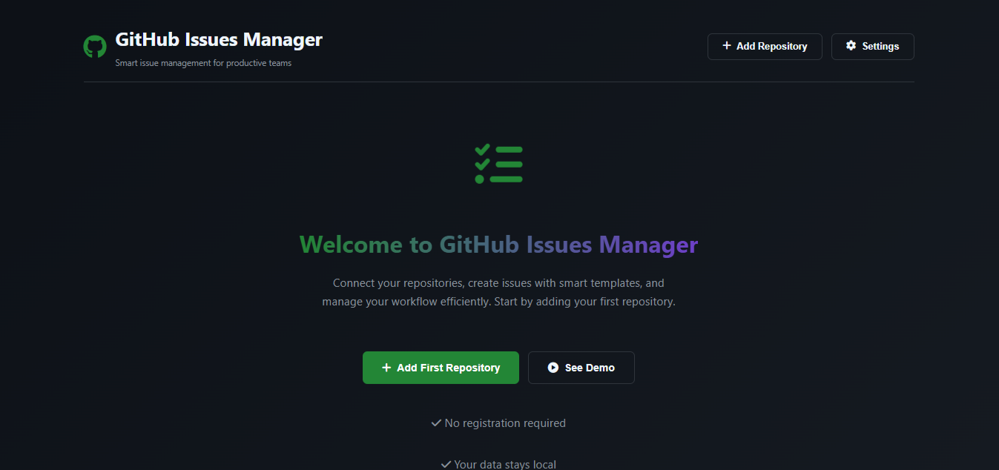
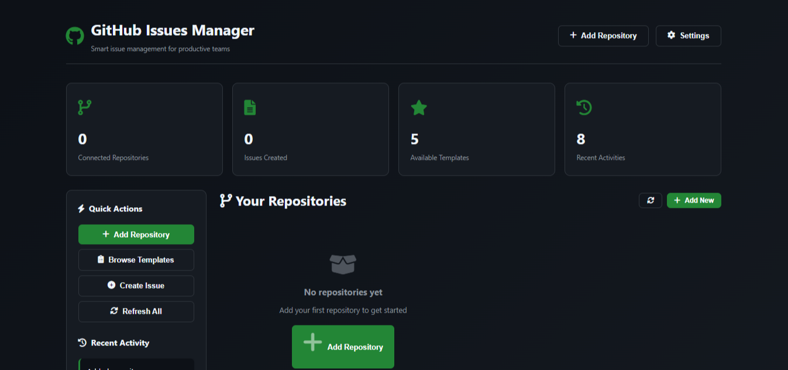
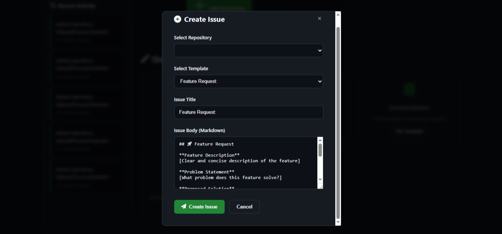
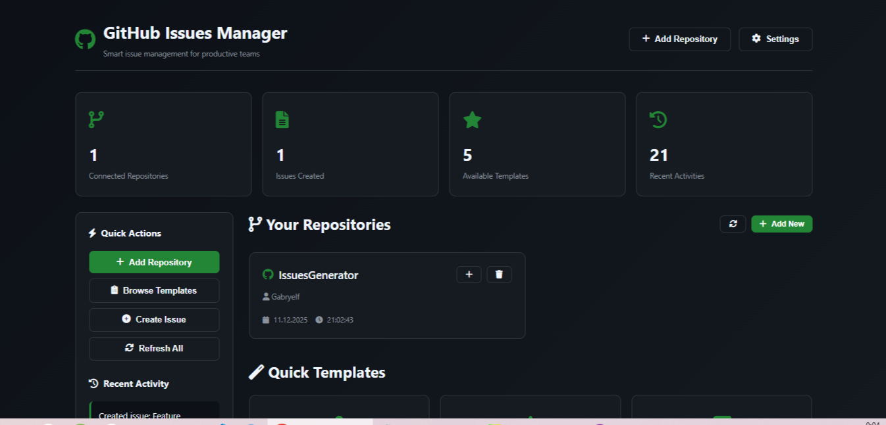

# ✨❤️ GitHub Issues Creator Pro ❤️✨

<div align="center">


## 📸 Screenshots

<div align="center">

### **Main Interface**
  
*Clean dark theme with repository cards and activity log*

### **Template Selection**
  
*Pre-built templates for different issue types*

### **Issue Creation**
  
*Markdown editor with live preview and formatting tools*

### **API Documentation**
  
*Interactive Swagger UI for API exploration*

</div>

**Advanced issue management with templates and repository cards**

[](https://issuesgenerator.onrender.com)
[](https://issuesgenerator.onrender.com/docs)

</div>

## ✨ Features

<div align="center">

| **Smart Templates** | **Repository Cards** | **Secure Storage** |
|:-------------------:|:--------------------:|:------------------:|
| 📝 Pre-built templates with fields | 💾 Save favorite repositories | 🔐 Encrypted token storage |
| 🎨 Markdown editor with preview | 🔄 Quick access to saved repos | ⚡ Fast Redis caching |
| 🔧 Customizable fields | 🗑️ Easy management | 🔒 Local-only processing |

</div>

## 🚀 Quick Start

### **1. Clone & Install**
```bash
git clone https://github.com/Gabryelf/IssuesGenerator.git
cd IssuesGenerator
```

### **2. Backend Setup**
```bash
cd backend
pip install -r requirements.txt
```

### **3. Start Redis** (optional - uses memory fallback)
```bash
# Windows: Download Redis from https://github.com/microsoftarchive/redis/releases
# Linux/Mac: docker run -d -p 6379:6379 redis:alpine
```

### **4. Run Application**
```bash
cd backend/src
python main.py
```

📡 **Server starts at:** `http://localhost:8000`


## 🔧 API Endpoints

| Method | Endpoint | Description |
|--------|----------|-------------|
| `GET` | `/api/templates` | Get all issue templates |
| `POST` | `/api/verify` | Verify GitHub repository connection |
| `POST` | `/api/issues/create` | Create GitHub issue |
| `GET` | `/api/repositories` | Get saved repositories |
| `GET` | `/health` | System health check |

> **Full API documentation:** `http://localhost:8000/docs`

## 🎯 Use Cases

### **For Developers**
- 🐛 **Bug Reports** - Structured template with environment details
- 🚀 **Feature Requests** - Clear format for proposal submission
- 📚 **Documentation** - Template for docs improvement requests
- 🔒 **Security Issues** - Private reporting template
- 👀 **Code Reviews** - Checklist-based review requests

### **For Teams**
- ✅ **Consistent Formatting** - Standardized issue structure
- ⚡ **Time Saving** - Reuse saved repositories and templates
- 🔄 **Workflow Integration** - API-first design for automation
- 📊 **Activity Tracking** - Built-in activity log

## 🛠️ Technology Stack

```yaml
Frontend:
  - HTML5/CSS3 with modern dark theme
  - Vanilla JavaScript with ES6+ features
  - Font Awesome icons
  - Responsive design (mobile & desktop)

Backend:
  - FastAPI (Python 3.11+)
  - Redis for caching (with memory fallback)
  - GitHub REST API integration
  - Pydantic for data validation
  - Uvicorn ASGI server

Security:
  - Token encryption with Fernet
  - No server-side token storage
  - CORS protection
  - Input validation and sanitization
```

## ⚡ Performance

<div align="center">

| Metric | Result |
|--------|--------|
| **API Response Time** | < 50ms |
| **Template Loading** | Instant |
| **Issue Creation** | 1-2 seconds |
| **Memory Usage** | ~50MB |

</div>

## 🎨 Customization

### **Create Custom Templates**
```python
# Example template configuration
{
    "name": "custom_template",
    "title": "Custom: ",
    "description": "Your custom template",
    "body": "## Custom Issue\n\n**Details:** {custom_field}",
    "fields": [
        {
            "name": "custom_field",
            "label": "Custom Field",
            "type": "text",
            "required": True
        }
    ]
}
```

### **Environment Variables**
```bash
ENVIRONMENT=development
REDIS_URL=redis://localhost:6379
FRONTEND_URL=http://localhost:8000
ENCRYPTION_KEY=your-secure-key
```

## 📦 Deployment

### **Local Development**
```bash
python main.py  # Auto-reload on changes
```

### **Production (Render.com)**
1. Connect GitHub repository
2. Set environment variables
3. Deploy with `Procfile`

### **Docker**
```bash
docker-compose up -d  # Includes Redis
```

## 🔍 Debug & Troubleshooting

### **Common Issues**
```bash
# 404 on API endpoints
# → Check server is running on port 8000
# → Verify frontend is in correct directory

# Token authentication fails
# → Ensure token has 'repo' scope
# → Check token hasn't expired

# Redis connection issues
# → Application will use memory fallback
# → Check Redis is running on port 6379
```

### **Debug Commands**
- **Ctrl+Shift+D** - Show debug panel
- **F12** - Browser console logs
- **/health** - API health check
- **/api/test** - Endpoint verification

## 🤝 Contributing

1. Fork the repository
2. Create feature branch (`git checkout -b feature/amazing`)
3. Commit changes (`git commit -m 'Add amazing feature'`)
4. Push to branch (`git push origin feature/amazing`)
5. Open Pull Request

## 📄 License

MIT License - see [LICENSE](LICENSE) file for details.

## 🔗 Links

<div align="center">

[](https://github.com)
[](https://fastapi.tiangolo.com)
[](https://redis.io)

</div>

---

<div align="center">

**Made with ❤️ for GitHub community**

⭐ **Star us on GitHub** if you find this useful!

</div>

---

## 📋 Screenshot Instructions

To add screenshots to your README:

1. Take screenshots of your application:
   - Main interface with dark theme
   - Template selection screen
   - Issue creation with preview
   - API documentation page

2. Save them in a `screenshots/` folder:
   - `main-interface.png` (1200x800)
   - `templates.png` (1200x800)
   - `create-issue.png` (1200x800)
   - `api-docs.png` (1200x800)

3. Replace the placeholder image URLs in the README with your actual screenshots.

---

## 🎯 Quick Reference Card

```yaml
Start server: python main.py
Frontend: http://localhost:8000
API Docs: http://localhost:8000/docs
Health Check: http://localhost:8000/health

Keyboard Shortcuts:
  Ctrl+Enter: Create issue
  Ctrl+S: Save draft
  Ctrl+Shift+D: Debug panel
  
Default Credentials:
  Username: Gabryelf
  Repository: IssuesGenerator
```

---

**Ready to create better GitHub issues? Start now at `http://localhost:8000` 🚀**
